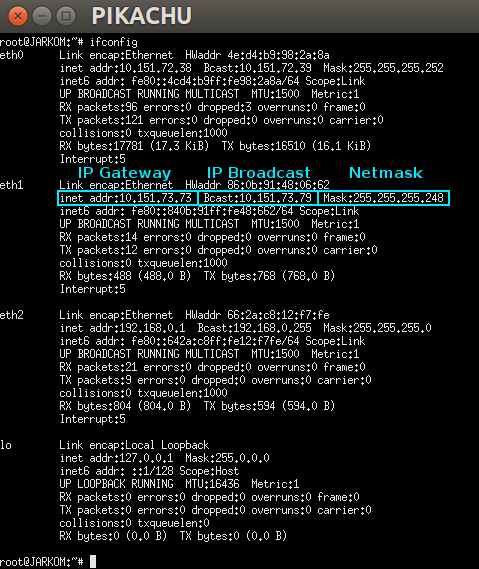

## 1. Dynamic Host Configuration Protocol (DHCP)
## Outline
+ [1. Dynamic Host Configuration Protocol (DHCP)]()
	+ [Outline]()
	+ [1.1 Konsep]()
		+ [1.1.1 Pendahuluan]()
		+ [1.1.2 Apa itu DHCP?]()
		+ [1.1.3 Bootstrap Protocol dan DHCP]()
		+ [1.1.4 DHCP Message Header]()
		+ [1.1.5 Cara Kerja DHCP]()
	+  [1.2 Implementasi](https://github.com/yogamahottama/jarkom-modul-3/tree/master/DHCP-Server#12-implementasi)
		+ [1.2.1 Instalasi ISC-DHCP-Server](https://github.com/yogamahottama/jarkom-modul-3/tree/master/DHCP-Server#121-instalasi-isc-dhcp-server)
	    + [1.2.2 Konfigurasi DHCP Server](https://github.com/yogamahottama/jarkom-modul-3/tree/master/DHCP-Server#122-konfigurasi-dhcp-server)
	   + [1.2.3 Konfigurasi DHCP Client](https://github.com/yogamahottama/jarkom-modul-3/tree/master/DHCP-Server#123-konfigurasi-dhcp-client)
	   + [1.2.4 Fixed Address](https://github.com/yogamahottama/jarkom-modul-3/tree/master/DHCP-Server#124-fixed-address)
	   + [1.2.5 Testing](https://github.com/yogamahottama/jarkom-modul-3/tree/master/DHCP-Server#125-testing)
	+ [1.3 Soal Latihan](https://github.com/yogamahottama/jarkom-modul-3/tree/master/DHCP-Server#13-soal-latihan)
	+ [1.4 Referensi](https://github.com/yogamahottama/jarkom-modul-3/tree/master/DHCP-Server#14-referensi)

## 1.1 Konsep
### 1.1.1 Pendahuluan
Pada modul-modul sebelumnya, kita telah mempelajari cara mengonfigurasi IP, nameserver, gateway, dan subnetmask pada UML secara manual. Metode manual ini oke-oke saja saat diimplementasikan pada jaringan yang memiliki sedikit host. Tapi bagaimana jika jaringan tersebut memiliki banyak host? Jaringan WiFi umum misalnya. Apakah Administrator Jaringannya harus mengonfigurasi setiap host-nya satu per satu? Membayangkannya saja mengerikan, ya.

Di sinilah peran DHCP sangat dibutuhkan.

### 1.1.2 Apa itu DHCP?
__Dynamic Host Configuration Protocol (DHCP)__  adalah protokol berbasis arsitektur _client-server_ yang dipakai untuk memudahkan pengalokasian alamat IP dalam satu jaringan. DHCP secara otomatis akan meminjamkan alamat IP kepada host yang memintanya.


Tanpa DHCP, administrator jaringan harus memasukkan alamat IP masing-masing komputer dalam suatu jaringan secara manual. Namun jika DHCP dipasang di jaringan, maka semua komputer yang tersambung ke jaringan akan mendapatkan alamat IP secara otomatis dari DHCP server.

### 1.1.3 Bootstrap Protocol dan Dynamic Host Configuration Protocol
Selain DHCP, terdapat protokol lain yang juga memudahkan pengalokasian alamat IP dalam suatu jaringan, yaitu Bootstrap Protocol (BOOTP). Perbedaan BOOTP dan DHCP terletak pada proses konfigurasinya.

| BOOTP | DHCP |
| --- | --- |
|Administrator jaringan melakukan konfigurasi mapping MAC Address client dengan IP tertentu. | Server akan melakukan peminjaman IP Address dan konfigurasi lainnya dalam rentang waktu tertentu. Protokol ini dibuat berdasarkan cara kerja BOOTP |

### 1.1.4 DHCP Message Header


### 1.1.5 Cara Kerja DHCP
DHCP bekerja dengan melibatkan dua pihak yakni __Server__ dan __Client__:
	1. __DHCP Server__ memberikan suatu layanan yang dapat memberikan alamat IP dan parameter lainnya kepada semua client yang memintanya.
	2. __DHCP Client__ adalah mesin client yang menjalankan perangkat lunak client yang memungkinkan mereka untuk dapat berkomunikasi dengan DHCP server.
DHCP Server umumnya memiliki sekumpulan alamat IP yang didistribusikan yang disebut DHCP Pool. Setiap client akan meminjamnya untuk rentan waktu yang ditentukan oleh DHCP sendiri (dalam konfigurasi). Jika masa waktu habis, maka client akan meminta alamat IP yang baru atau memperpanjangnya. Itulah sebabnya alamat IP client menjadi dinamis.


Terdapat 4 tahapan yang dilakukan dalam proses peminjaman alamat IP pada DHCP:
	1. __DHCPDISCOVER__: Client menyebarkan request secara broadcast untuk mencari DHCP Server yang aktif. DHCP Server menggunakan UDP port 67 untuk menerima broadcast dari client melalui port 68.
	2. __DHCPOFFER__: DHCP server menawarkan alamat IP (dan konfigurasi lainnya apabila ada) kepada client. Alamat IP yang ditawarkan adalah salah satu alamat yang tersedia dalam DHCP Pool pada DHCP Server yang bersangkutan.
	3. __DHCPREQUEST__: Client menerima tawaran dan menyetujui peminjaman alamat IP tersebut kepada DHCP Server.
	4. __DHCPACK__: DHCP server menyetujui permintaan alamat IP dari client dengan mengirimkan paket ACKnoledgment berupa konfirmasi alamat IP dan informasi lain. Kemudian client melakukan inisialisasi dengan mengikat (binding) alamat IP tersebut dan client dapat bekerja pada jaringan tersebut. DHCP Server akan mencatat peminjaman yang terjadi.
	5. __DHCPRELEASE__: Client menghentikan peminjaman alamat IP (apabila waktu peminjaman habis atau menerima DHCPNAK).


## 1.2 Implementasi
### 1.2.1 Instalasi ISC-DHCP-Server
Pada topologi ini, kita akan menjadikan router __PIKACHU__ sebagai DHCP Server. Oleh sebab itu, kita harus meng-_install_ __isc-dhcp-server__ di __PIKACHU__ dengan melakukan langkah-langkah berikut:
1. Update _package lists_ di router __PIKACHU__ dengan perintah
```
apt-get update
```
2. Install __isc-dhcp-server__ di router __PIKACHU__
```
apt-get install isc-dhcp-server
```


__[FAIL]__ Eits, jangan panik dulu!!! Coba dibaca baik-baik, yang gagal bukanlah proses instalasinya, namun proses `starting ISC DHCP server`. Hal ini terjadi karena kita belum mengonfigurasi interface-nya. Mari kita lanjutkan ke langkah berikutnya!

### 1.2.2 Konfigurasi DHCP Server
Langkah-langkah yang harus dilakukan setelah instalasi adalah:
#### A. Menentukan interface mana yang akan diberi layanan DHCP
##### A.1. Buka file konfigurasi interface dengan perintah
```
nano /etc/default/isc-dhcp-server
```
##### A.2. Tentukan interface.
Coba perhatikan topologi yang telah kalian buat. Interface dari router __PIKACHU__ yang menuju ke client __PSYDUCK__, __SNORLAX__, dan __CUBONE__ adalah `eth2`, maka kita akan memilih interface `eth2` untuk diberikan layanan DHCP.
	
```
INTERFACES="eth2"
```
	


#### B. Langkah selanjutnya adalah mengonfigurasi DHCP
Ada banyak hal yang dapat dikonfigurasi, antara lain:
+ Range IP
+ DNS Server
+ Informasi Netmask
+ Default Gateway
+ dll.
##### B.1.  Buka file konfigurasi DHCP dengan perintah
```
nano /etc/dhcp/dhcpd.conf
```
##### B.2. Tambahkan script berikut
```
subnet 'NID' netmask 'Netmask' {
    range 'IP_Awal' 'IP_Akhir';
    option routers 'iP_Gateway';
    option broadcast-address 'IP_Broadcast';
    option domain-name-servers 'DNS_yang_diinginkan';
    default-lease-time 'Waktu';
    max-lease-time 'Waktu';
}
```
Script tersebut mengatur parameter jaringan yang dapat didistribusikan oleh DHCP, seperti informasi netmask, default gateway dan DNS server. Berikut ini beberapa parameter jaringan dasar yang biasanya digunakan:

| __No__ | __Parameter Jaringan__ | __Keterangan__ |
|---|---|---|
| 1 | `subnet 'NID'` | Netword ID pada subnet |



Sehingga konfigurasinya menjadi:


##### A.3. Restart service `isc-dhcp-server` dengan perintah
```
service isc-dhcp-server restart
```
Jika terjadi __failed!__, maka stop dulu, kemudian start kembali
```
service isc-dhcp-server stop
service isc-dhcp-server start
```


Konfigurasi DHCP Server selesai!

### 1.2.3 Konfigurasi DHCP Client
Setelah mengonfigurasi server, kita juga perlu mengonfigurasi interface client supaya bisa mendapatkan layanan dari DHCP server. Di dalam topologi ini, clientnya adalah __PSYDUCK__, __SNORLAX__, dan __CUBONE__.
#### A. Mengonfigurasi Client
##### A.1. Periksa IP PSYDUCK dengan `ifconfig`


Dari konfigurasi sebelumnya, __PSYDUCK__ telah diberikan IP statis 192.168.0.2
##### A.2. Buka `/etc/network/interfaces` untuk mengonfigurasi interface __PSYDUCK__
```
nano /etc/network/interfaces
```
##### A.3. Comment atau hapus konfigurasi yang lama (konfigurasi IP statis)
Lalu tambahkan:
```
auto eth0
iface eth0 inet dhcp
```


__Keterangan__:
+ __eth0__ adalah interface yang digunakan client
+ `iface eth0 inet dhcp`: memberikan konfigurasi DHCP pada interface eth0, bukan konfigurasi statis

##### A.4. Restart network dengan perintah `service networking restart`


#### B. Testing
Cek kembali IP __PSYDUCK__ dengan menjalankan `ifconfig`


Periksa juga apakah __PSYDUCK__ sudah mendapatkan DNS server sesuai konfigurasi di DHCP. Periksa `/etc/resolv.conf` dengan menggunakan perintah
```
cat /etc/resolv.conf
```


Bila IP dan nameserver __PSYDUCK__ telah berubah sesuai dengan konfigurasi yang diberikan oleh DHCP, maka selamat. Kalian telah berhasil!

__Keterangan__:
+ Jika IP __PSYDUCK__ masih belum berubah, jangan panik. Lakukanlah kembali `service networking restart`
+ Jika masih belum berubah juga, jangan buru-buru bertanya. Coba periksa lagi semua konfigurasi yang telah kalian lakukan, mungkin terdapat kesalahan penulisan.

#### C. Lakukan kembali langkah - langkah di atas pada client SNORLAX dan CUBONE
+ Client __SNORLAX__


+ Client __CUBONE__


Setelah IP dipinjamkan ke sebuah client, maka IP tersebut tidak akan diberikan ke client lain. Buktinya, tidak ada client yang mendapatkan IP yang sama.

### 1.2.4 Fixed Address
> __Sebuah Kasus__:
> 
> Ternyata PC __CUBONE__ selain menjadi client, juga akan digunakan sebagai server suatu aplikasi, sehingga akan menyulitkan jika IP nya berganti-ganti setiap __CUBONE__ terhubung ke jaringan internet. Oleh karena itu, __CUBONE__ membutuhkan IP yang tidak berganti-ganti.

Untuk menyelesaikan kasus tersebut, DHCP Server memiliki layanan untuk "menyewakan" alamat IP secara tetap pada suatu host, yakni __Fixed Address__. Dalam kasus ini, __CUBONE__ akan mendapatkan IP tetap 192.168.0.15

#### A. Konfigurasi DHCP Server di router PIKACHU
##### A.1. Buka file konfigurasi DHCP dengan perintah
```
nano /etc/dhcp/dhcpd.conf
```
##### A.2. Tambahkan script berikut
```
host cubone {
    hardware ethernet 'hwaddress_cubone';
    fixed-address 192.168.0.15;
}
```


__Penjelasan__:
+ Untuk mencari `'hwaddress_cubone'` (hardware address) kalian bisa memeriksanya di UML __CUBONE__ dengan command `ifconfig`


+ __fixed-address__ adalah alamat IP yang "disewa" tetap oleh __CUBONE__

##### A.3. Restart service `isc-dhcp-server` dengan perintah
```
service isc-dhcp-server restart
```
#### B. Konfigurasi DHCP Client
##### B.1. Buka `/etc/network/interfaces` untuk mengonfigurasi interface __CUBONE__
```
nano /etc/network/interfaces
```
##### B.2. Buka `/etc/network/interfaces` untuk mengonfigurasi interface __CUBONE__
Lalu tambahkan:
```
hwaddress ether 'hwaddress_CUBONE'
```


__Keterangan__:
Hardware addresss perlu di-_setting_ juga di `/etc/network/interfaces` karena perangkat yang kalian gunakan adalah perangkat virtual (UML), dimana hwaddress-nya akan berubah setiap kali dijalankan.

#### B.3. Restart network dengan perintah `service networking restart`


#### C. Testing
Periksa IP __CUBONE__ dengan melakukan `ifconfig`


IP __CUBONE__ telah berubah menjadi 192.168.0.15 sesuai dengan Fixed Address yang diberikan oleh DHCP Server.
<!--stackedit_data:
eyJoaXN0b3J5IjpbMTA5MTkxMzkzOSwtMTA2MzQzOTE1NSwtMT
MwOTQwMzIwMSw5MzcwNzUwODMsLTEwOTAwNzg3NDgsLTE0NTY1
NjI1NSwxMTAxMzA5MDQ2LDE3Mzc1OTk0NTAsLTEwNzM5MjU4LC
0xMTIwNTg4NzkxLDEzNzgxOTg4MDcsMTEzMDM3MzI0NSwyMTMw
MDI3ODY0LC0yMDc3ODMyMzE0LC01NjEwMjE4NDIsMjA5MDMyOT
E0OF19
-->